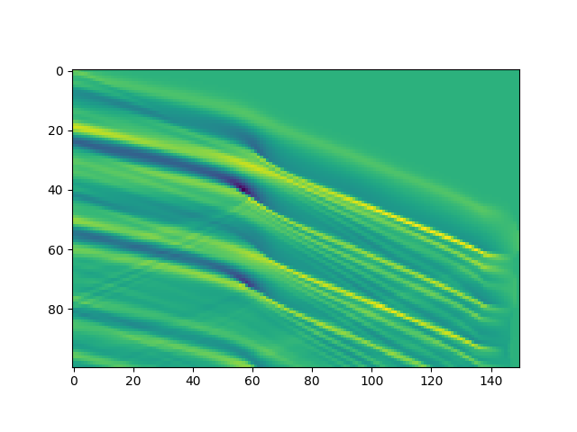
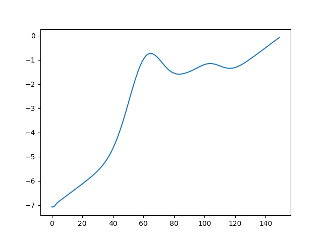

Theory and Background
=====================

Physics of the wave
-------------------

Bathymetry estimation is not a new problem. Actually, there are already few
solutions to approximate the sea floor. Many of them are based on what we call 
a DIA (Depth Inversion Algorithms), this article :cite:`DIA` summarize few of 
them. Such an algorithm is based on the inversion of a dispersion relationship 
between the celerity and the depth.

.. math::
	
	\Omega (\underline{k}) = \sqrt{gk\tanh(kh_r)} \mbox{ avec } k = \|\underline{k}\|

But actually, all is physically linked, thus the bathymetry influences also
the wavelength, the wave height, or the refraction. I invite you to check the 
chapter 8 of this book :cite:`thual` for more information about the physics of 
the waves.

Timestack
---------

We first need a representation of the waves according to time. Our model is 
quite simplified, so we will consider here an infinite beach where the 
bathymetry just varies on the :math:`x` axis. In that case, a wave can be 
described by one vector carrying the elevation according to the position 
:math:`x` at a time :math:`t`. Concatenating these vectors along time create an
image called timestack. Here is an example:

|pic1|  |pic2|

The color represents the height of the water at a certain point :math:`x`. 
These timestacks are built from real videos of litoral, the process to get 
timestack from them are described in this article :cite:`almar`.

